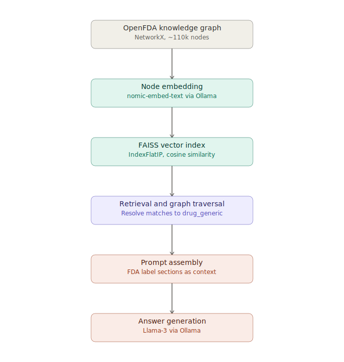

# GraphRAG OpenFDA

A GraphRAG pipeline over a prebuilt OpenFDA drug-label knowledge graph, using
NetworkX for graph storage/traversal, Ollama (`llama3` + `nomic-embed-text`)
for embeddings and generation, and FAISS for vector search.

Given a natural-language question, the pipeline retrieves the relevant
drug(s) from the graph, pulls their full FDA label sections via a single-hop
graph traversal, assembles that into a grounded prompt, and asks Llama-3 to
answer using only that context.

Because the graph and embedding artifacts are too large for this repository,
they're distributed via Google Drive:

https://drive.google.com/drive/folders/1C0KmSjRvNmOW-PvxzUiedcediCZHdZAl?usp=sharing

---

## How it works



### 1. Graph schema

The graph is undirected and has two layers of nodes:

- **Entity nodes**: `drug_generic` (~10.8k) and `drug_brand` (~31.8k). A
  `drug_brand` connects to exactly one `drug_generic` via a `BRAND_GENERIC`
  edge.
- **Section nodes**: 14 types attached to each `drug_generic`, including
  `warnings`, `dosage_and_administration`, `indications_and_usage`,
  `active_ingredient`, `purpose`, `do_not_use`,
  `keep_out_of_reach_of_children`, `pregnancy_or_breast_feeding`,
  `inactive_ingredient`, and others.

**Important structural detail:** every `drug_generic` connects directly
(1 hop) to *all* of its section nodes. Section nodes also connect to each
other, forming a dense redundant mesh per drug — this is an artifact of how
the graph was built, not meaningful semantic relationships (e.g. a
`DOSAGE_WARNING` edge doesn't mean "dosage causes warnings"). The pipeline
intentionally ignores this mesh and only traverses `drug_generic ->
section` edges, since that single hop already contains everything needed to
answer a query about a given drug.

Node text content lives in two different fields depending on type:
- `drug_generic` / `drug_brand`: the drug/brand name itself is in `name`;
  `description` is empty.
- All section types: the real FDA label text is in `description`; `name` is
  just a repeated label (e.g. `"warnings ((LIDOCAINE))"`) with no
  additional content.

### 2. Embedding

Every node (~110k total) is embedded once, offline, using Ollama's
`nomic-embed-text` model, and stored in a FAISS `IndexFlatIP` index (exact
cosine similarity via L2-normalized inner product — appropriate at this
scale; would need an approximate index like `IndexHNSWFlat` only if the
graph grew past roughly a million nodes).

**Known gap:** there is currently no chunking. Each node's full text field
is embedded as a single vector, however long it is. Long sections dilute
their own embedding signal, and the embedding call doesn't set an explicit
context window, so unusually long text can be silently truncated before
embedding with no error raised. This is the most impactful item on the
roadmap below.

### 3. Query-time retrieval

1. The query is embedded with the same model (`nomic-embed-text` — this
   must always match the model used to build the index, or similarity
   scores become meaningless).
2. FAISS returns the top-`k` most similar nodes.
3. Matches are filtered to a similarity threshold (currently `0.70`) and
   resolved back to their parent `drug_generic` (a `drug_brand` or section
   match walks one hop to find its generic parent; duplicates are removed).
4. All qualifying drugs' full label sections are pulled and assembled into
   one prompt, ordered by a fixed section priority list.
5. The prompt instructs Llama-3 to answer only from the provided label
   text and to say so explicitly if the answer isn't present, rather than
   guessing.

### 4. Parameters reference

| Parameter | Current value | What it controls |
|---|---|---|
| Embedding model | `nomic-embed-text` | Must match between index build and query time |
| Generation model | `llama3` (tag unpinned) | Should be pinned, e.g. `llama3:8b`, for reproducibility |
| Temperature | `0.1` | Lower = more deterministic, less likely to drift from provided context |
| `num_ctx` (generation) | `8192` | Max combined size of prompt + context the model can see; excess is silently dropped |
| `num_ctx` (embedding) | not set | Uses Ollama's default; risk of silent truncation on long sections |
| Chunk size | none (whole field per node) | See "Known gap" above |
| FAISS index type | `IndexFlatIP` | Exact search; fine up to roughly 1M vectors |
| Retrieval `k` | 5–20 depending on call site | Pool size before filtering; wider `k` for broad/symptom queries |
| Similarity threshold | `0.70` | Chosen manually, not yet validated against a labeled test set |
| Brand display cap | 15 per drug | Keeps large brand lists from crowding out label content in the prompt |

---

## Repository contents

- `README.md` — this file.
- `requirements.txt` — Python dependencies.
- Notebook / pipeline script — provided separately (see Drive link).

## Required data files

Place these in your project's data folder (default expected location:
`../../Rag_files/graph_rag/`):

- `graph_with_embeddings.pkl` — the graph with a 768-dim `nomic-embed-text`
  embedding attached to each node.
- `graph_nodes.index` — the FAISS index built from those embeddings.
- `node_id_map.pkl` — maps FAISS index positions back to graph node IDs.
- `embeddings_checkpoint.pkl` — raw embedding checkpoint (used for
  resuming an interrupted embedding run; not required at query time).

If missing, download from the Drive link above.

---

## Setup

### Python
Python 3.9+.

```powershell
python -m pip install -r requirements.txt
```

### Ollama

Install from https://ollama.com/download, then verify:

```powershell
ollama --version
```

If not found, add the install path to `PATH` (commonly
`C:\Program Files\Ollama` on Windows).

Start the server and pull both required models:

```powershell
ollama serve
ollama pull llama3
ollama pull nomic-embed-text
```

On Colab, all of this is handled inside the notebook's setup cell — no
separate installation needed.

### Windows local environment

```powershell
cd path\to\GraphRAG_OpenFDA
python -m venv .venv
.\.venv\Scripts\Activate.ps1
python -m pip install --upgrade pip
python -m pip install -r requirements.txt
python -m pip install notebook jupyterlab
jupyter lab
```

---

## Running the workflow

**Colab:** open the notebook, mount Drive (or download the data files
manually), and run cells top to bottom. The last cell prompts for a
question interactively.

**Local:** after setup above, run the pipeline script or notebook from the
project root. It expects the data files in the path noted above.

Example question:

```text
What should I avoid if I am pregnant and using lidocaine?
```

The pipeline retrieves LIDOCAINE's label context (all 9 of its sections),
builds a grounded prompt, and returns an answer sourced from the
`pregnancy_or_breast_feeding` and `warnings` sections specifically.

---

## Troubleshooting

**"Failed to connect to Ollama" / embedding calls returning 404:**
- Ollama isn't running — run `ollama serve`.
- The required model isn't pulled yet — run `ollama pull llama3` and
  `ollama pull nomic-embed-text`. A 404 specifically (rather than
  connection refused) usually means the model name is valid syntax but
  isn't actually present locally yet; check with `ollama list`.
- On a hosted notebook (Colab/Kaggle), confirm Ollama is running in the
  *same* container as the notebook kernel — `localhost` won't reach a
  separate machine.

**Graph file not found:** confirm the data folder path and that all three
`.pkl`/`.index` files are present (see "Required data files" above).

**FAISS index size doesn't match `node_id_map` length:** this means some
nodes failed to embed during the build (check the embedding run's printed
`failed` list) and were silently excluded. Re-run embedding for the missing
node IDs, or accept a small permanent gap in retrieval coverage.

**Notebook kernel issues:** confirm the correct Python environment/venv is
selected in Jupyter.

---

## Known limitations / roadmap

- **No chunking** — long sections are embedded whole; splitting into
  smaller overlapping chunks would improve retrieval precision on narrow
  queries (highest-priority fix).
- **Similarity threshold (0.70) is unvalidated** — real test queries have
  shown borderline-unrelated drugs scoring above this cutoff; should be
  tuned against a labeled test set rather than left as a guess.
- **No cap on aggregated context length** for multi-drug queries — a broad
  query can pull in enough drugs to exceed `num_ctx=8192`, causing silent
  truncation of later drugs in the prompt with no warning.
- **Generation model tag is unpinned** (`llama3` rather than `llama3:8b`),
  which risks silent behavior changes if Ollama's default build updates.
- **No source attribution in answers** — the model doesn't currently cite
  which drug/section justified each claim, which matters for auditing
  potential hallucination in a medical-data context.
- **Nodes that failed to embed are not retried** — any node dropped during
  the embedding run stays permanently excluded from retrieval unless
  manually re-run.

---

## Recommended next steps

- Validate the similarity threshold against a small labeled test set of
  (question, expected drug) pairs.
- Add section-aware chunking for long label sections.
- Add a token-budget-aware cap when assembling multi-drug context.
- Pin the generation model to an exact tag.
- Add citation/source tracking to generated answers.
